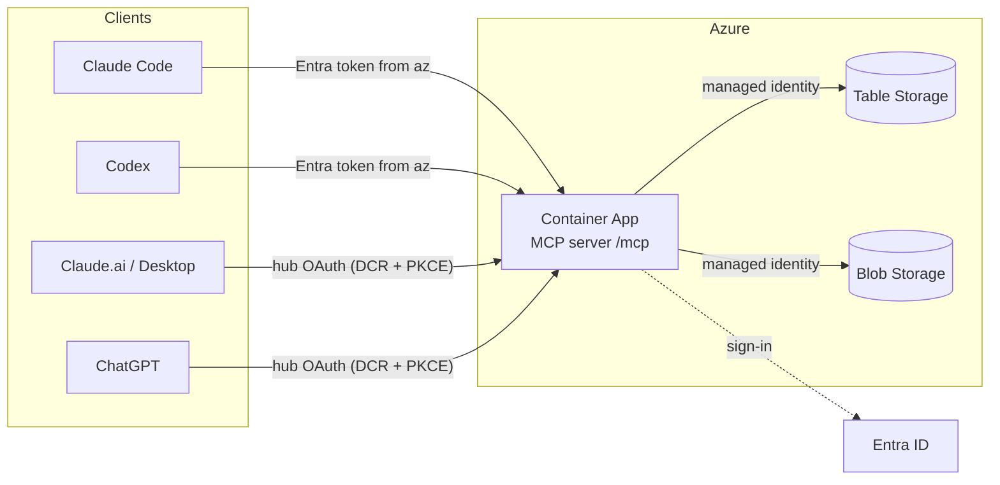

# AI Collab Hub

[](https://github.com/net9876/ai-collab-hub/actions/workflows/ci.yml)
[](LICENSE)

Shared working state for several AI agents of one person — **Claude Code**,
**Codex**, **Claude.ai / Desktop** and **ChatGPT** — through a remote MCP
server on Azure Container Apps, backed by Azure Table + Blob Storage and
protected by Microsoft Entra ID.

- **Git (this repo)** holds rules, skills, schemas, code and infrastructure.
- **The hub** holds working state: memories, decisions, tasks, messages,
  project cards and session checkpoints — each with an ID, UTC timestamps, a
  verified author, a revision and history.
- Agents get **typed CRUD tools only**. Nothing in the hub can run commands,
  and messages or tasks never make another agent act on their own.

## Why

Every AI client starts each conversation from zero and none of them sees what
the others learned. The hub is one small, auditable place where they all read
and write the same facts, decisions and tasks, so work can move between clients
without copy-pasting context.

## What you get

- Shared memory, decisions (ADR-style, supersedable), tasks with atomic
  claiming, messages between agents, and session checkpoints for handoff.
- One identity model: Entra sign-in, a verified user and a per-client agent label.
- No secrets to manage: managed identity, GitHub OIDC, storage keys disabled.
- Reproducible with Terraform; about $9–12 per month (`docs/costs.md`).
- Tested without Azure: server tests run against the Azurite emulator through a
  real MCP client.

## Architecture



Details: `docs/architecture.md`.

## Prerequisites

- To run the tests locally: Python 3.13, Node.js 22 (for Azurite), PowerShell 7
  (Windows PowerShell 5.1 also works for the scripts).
- To deploy: an Azure subscription (Owner, or Contributor + User Access
  Administrator), rights to create Entra app registrations, Azure CLI,
  Terraform ≥ 1.9 (the setup script can install local copies), and optionally
  GitHub CLI.

## Quick start (local, no Azure changes)

```powershell
pwsh -File scripts/setup.ps1       # Windows PowerShell 5.1: powershell -ExecutionPolicy Bypass -File scripts\setup.ps1
pwsh -File scripts/validate.ps1
```

`validate.ps1` runs ruff, mypy, the pytest suite (Azurite Blob+Table emulator
and a real MCP client over HTTP: handshake, tools/list, tools/call, auth
denial, pagination, concurrent task claims, storage failures), Terraform
fmt/validate, checkov and a secret/private-ID scan.

## Deploy and connect

Full commands are in `docs/runbook.md`. In short:

1. **Bootstrap** (`infra/bootstrap`): Terraform state storage, the Entra API
   app and the GitHub OIDC identity. Copy `terraform.tfvars.example` to
   `terraform.tfvars` and fill in your IDs (git-ignored).
2. **Main stack, step 1** (`infra/terraform`): storage, registry, logs, RBAC;
   `deploy_app = false`.
3. **Build the first image** in Azure: `az acr build` (no local Docker).
4. **Main stack, step 2**: set `deploy_app = true` and the image, apply, read
   the `mcp_url` output.
5. **Smoke test**: 401 without a token, then `scripts/smoke.py` with one.
6. **Connect clients**: `scripts/connect-claude.ps1`, `scripts/connect-codex.ps1`;
   for Claude.ai and ChatGPT follow `docs/connect-chatgpt.md`.
7. **Optional**: GitHub `deploy` workflow (OIDC, manual trigger).

## Client support

| Client | Supported | How |
|---|---|---|
| Claude Code | yes | `.mcp.json` HTTP server + `headersHelper` getting an Entra token from `az` |
| Codex (ChatGPT desktop app or CLI) | yes | project `.codex/config.toml` with `http_headers_helper` (same `az` token helper); open the repo as a trusted project |
| Claude.ai / Claude Desktop | yes (custom connector) | hub OAuth server: DCR + PKCE, Entra sign-in, consent page; `docs/connect-chatgpt.md` |
| ChatGPT (developer mode, web) | yes (custom connector) | same OAuth server; write tools need ChatGPT's confirmation |

## Layout

```
AGENTS.md, CLAUDE.md        client bootstrap -> shared/RULES.md
shared/                     RULES, PROJECTS, DECISIONS, profile/preference templates
skills/                     azure-architecture, terraform-review, research (SKILL.md)
server/                     Python MCP server (collab_hub) + tests
infra/bootstrap/            state backend, Entra API app, GitHub OIDC identity
infra/terraform/            Storage, ACR, Log Analytics, Container Apps, RBAC
scripts/                    setup, validate, connect-claude, connect-codex, smoke
docs/                       architecture, api, security, costs, compatibility, runbook
.github/workflows/          ci (lint/test/scan/build), deploy (manual, OIDC)
```

## Limits worth knowing

- Tokens come from your Azure CLI login and last ~60–90 minutes; Claude Code
  and Codex both re-run the header helper on reconnect.
- The agent label (`X-Collab-Agent`) is self-declared; the user identity is
  verified.
- Search is keyword/metadata matching over Azure Table, not full-text search.
- Storage and registry endpoints are public (Entra-only access, keys disabled).
- Single user: the workspace model supports more, but this is not a
  multi-tenant product.

## Documentation

`docs/STATUS.md` (current state), `docs/architecture.md`, `docs/api.md`,
`docs/security.md`, `docs/costs.md`, `docs/compatibility.md`, `docs/runbook.md`,
`docs/workflow.md` (sessions, checkpoints, handoff), `docs/roadmap.md`.

## Contributing, security, license

[CONTRIBUTING.md](CONTRIBUTING.md) · [SECURITY.md](SECURITY.md) · [MIT License](LICENSE)
