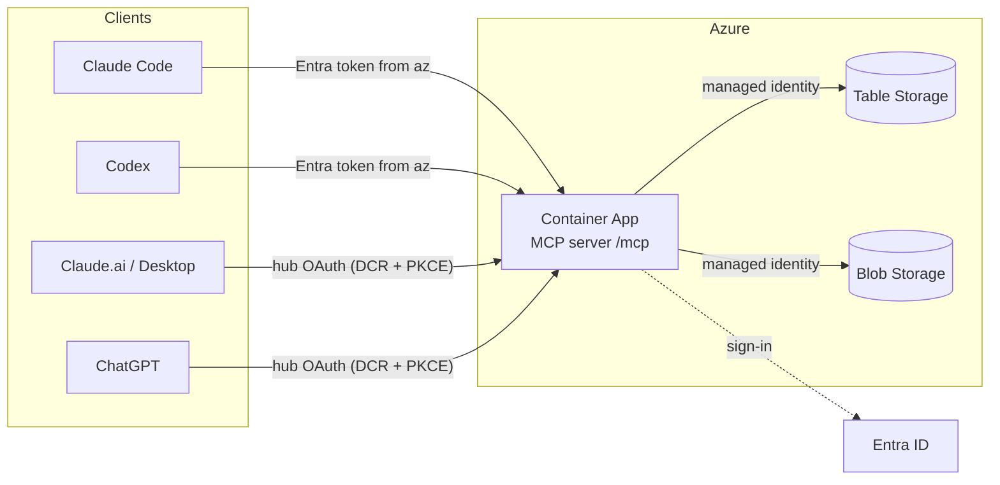

# AI Collab Hub

[](https://github.com/net9876/ai-collab-hub/actions/workflows/ci.yml)
[](LICENSE)

AI Collab Hub is a self-hosted MCP server that provides shared working state for **ChatGPT**, **Claude.ai / Desktop**, **Claude Code** and **Codex**. It runs on Azure Container Apps, uses Azure Table and Blob Storage, and authenticates users through Microsoft Entra ID.

## Why this exists

AI clients keep separate conversation and project context. Switching clients often means rebuilding requirements, decisions and progress by hand. The hub provides a common store that connected clients can read and update across discussions and work sessions, including research, learning, personal planning and software development. Agent roles are chosen for each task or discussion.

## Capabilities

- Project-scoped memories, decisions, tasks and messages, with provenance and revision history where supported.
- Structured session checkpoints and explicit cross-client resume workflows.
- Atomic task claiming and explicit ownership handoff and acceptance.
- Typed record operations through MCP; the hub does not execute code or automatically invoke agents.
- Entra-authenticated user identity; client labels remain self-declared.
- Terraform-defined infrastructure, managed identity for storage access, and GitHub OIDC for deployment.

The repository holds code, infrastructure, schemas and shared instructions. The hub holds working state. Clients must explicitly save and retrieve context; native conversations and uncommitted files are not automatically synchronized.

This is an open-source personal project for others to inspect, deploy and adapt. See [Architecture](#architecture), [Deploy and connect](#deploy-and-connect), [workflow examples](docs/workflow.md) and [cost estimates](docs/costs.md) for implementation and usage details.

## Architecture



Details: `docs/architecture.md`.

## Prerequisites

- To run the tests locally: Python 3.13, Node.js 22 (for Azurite), PowerShell 7
  (Windows PowerShell 5.1 also works for the scripts).
- To deploy: an Azure subscription (Owner, or Contributor + User Access
  Administrator), rights to create Entra app registrations, Azure CLI,
  Terraform ≥ 1.9 (the setup script can install local copies), and optionally
  GitHub CLI.

## Quick start (local, no Azure changes)

```powershell
pwsh -File scripts/setup.ps1       # Windows PowerShell 5.1: powershell -ExecutionPolicy Bypass -File scripts\setup.ps1
pwsh -File scripts/validate.ps1
```

`validate.ps1` runs ruff, mypy, the pytest suite (Azurite Blob+Table emulator
and a real MCP client over HTTP: handshake, tools/list, tools/call, auth
denial, pagination, concurrent task claims, storage failures), Terraform
fmt/validate, checkov and a secret/private-ID scan.

## Deploy and connect

Full commands are in `docs/runbook.md`. In short:

1. **Bootstrap** (`infra/bootstrap`): Terraform state storage, the Entra API
   app and the GitHub OIDC identity. Copy `terraform.tfvars.example` to
   `terraform.tfvars` and fill in your IDs (git-ignored).
2. **Main stack, step 1** (`infra/terraform`): storage, registry, logs, RBAC;
   `deploy_app = false`.
3. **Build the first image** in Azure: `az acr build` (no local Docker).
4. **Main stack, step 2**: set `deploy_app = true` and the image, apply, read
   the `mcp_url` output.
5. **Smoke test**: 401 without a token, then `scripts/smoke.py` with one.
6. **Connect clients**: `scripts/connect-claude.ps1`, `scripts/connect-codex.ps1`;
   for Claude.ai and ChatGPT follow `docs/connect-chatgpt.md`.
7. **Optional**: GitHub `deploy` workflow (OIDC, manual trigger).

## Client support

| Client | Supported | How |
|---|---|---|
| Claude Code | yes | `.mcp.json` HTTP server + `headersHelper` getting an Entra token from `az` |
| Codex (ChatGPT desktop app or CLI) | yes | project `.codex/config.toml` with `http_headers_helper` (same `az` token helper); open the repo as a trusted project |
| Claude.ai / Claude Desktop | yes (custom connector) | hub OAuth server: DCR + PKCE, Entra sign-in, consent page; `docs/connect-chatgpt.md` |
| ChatGPT (developer mode, web) | yes (custom connector) | same OAuth server; write tools need ChatGPT's confirmation |

## Layout

```
AGENTS.md, CLAUDE.md        client bootstrap -> shared/RULES.md
shared/                     RULES, PROJECTS, DECISIONS, profile/preference templates
skills/                     azure-architecture, terraform-review, research (SKILL.md)
server/                     Python MCP server (collab_hub) + tests
infra/bootstrap/            state backend, Entra API app, GitHub OIDC identity
infra/terraform/            Storage, ACR, Log Analytics, Container Apps, RBAC
scripts/                    setup, validate, connect-claude, connect-codex, smoke
docs/                       architecture, api, security, costs, compatibility, runbook
.github/workflows/          ci (lint/test/scan/build), deploy (manual, OIDC)
```

## Limits worth knowing

- Tokens come from your Azure CLI login and last ~60–90 minutes; Claude Code
  and Codex both re-run the header helper on reconnect.
- The agent label (`X-Collab-Agent`) is self-declared; the user identity is
  verified.
- Search is keyword/metadata matching over Azure Table, not full-text search.
- Storage and registry endpoints are public (Entra-only access, keys disabled).
- Single user: the workspace model supports more, but this is not a
  multi-tenant product.

## Documentation

`docs/STATUS.md` (current state), `docs/architecture.md`, `docs/api.md`,
`docs/security.md`, `docs/costs.md`, `docs/compatibility.md`, `docs/runbook.md`,
`docs/workflow.md` (sessions, checkpoints, handoff), `docs/dashboard.md` (read-only web
dashboard), `docs/roadmap.md`.

## Contributing, security, license

[CONTRIBUTING.md](CONTRIBUTING.md) · [SECURITY.md](SECURITY.md) · [MIT License](LICENSE)
